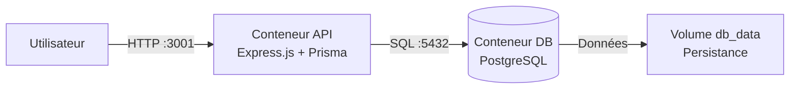

# Schéma d'architecture

## Vue d'ensemble

L'application utilise une architecture multi-conteneurs avec deux services principaux :
- **API** : Application Express.js avec Prisma
- **Base de données** : PostgreSQL 16

## Schéma



### Schéma ASCII

```
┌─────────────┐
│  Utilisateur│
└──────┬──────┘
       │ HTTP (port 3001)
       ▼
┌─────────────┐      ┌─────────────┐
│ Conteneur   │─────▶│ Conteneur   │
│ API         │ SQL  │ Base de     │
│ (tp_api)    │      │ données     │
│ Port: 3000  │      │ (tp_db)     │
└─────────────┘      │ Port: 5432  │
                     └──────┬──────┘
                            │
                            ▼
                     ┌─────────────┐
                     │ Volume      │
                     │ db_data     │
                     │ (Persistant)│
                     └─────────────┘
```

## Composants

### Conteneur API (`tp_api`)
- **Image** : Node.js 20 Alpine
- **Port interne** : 3000
- **Port exposé** : 3001
- **Rôle** : Servir l'API REST et le frontend

### Conteneur Base de données (`tp_db`)
- **Image** : PostgreSQL 16
- **Port** : 5432
- **Rôle** : Stocker les données de l'application
- **Volume** : `db_data` pour la persistance

## Flux de données

1. L'utilisateur envoie une requête HTTP sur le port 3001
2. L'API traite la requête via Express.js
3. Si nécessaire, l'API interroge la base de données via Prisma
4. La base de données lit/écrit dans le volume persistant
5. L'API renvoie la réponse à l'utilisateur

## Réseau

Docker Compose crée automatiquement un réseau isolé permettant aux conteneurs de communiquer entre eux. L'API se connecte à la base de données via le nom de service `db`.

## Sécurité

- Utilisateur non-root dans le conteneur API
- Réseau Docker isolé pour la communication interne
- Variables d'environnement pour les secrets
- Image Alpine légère
